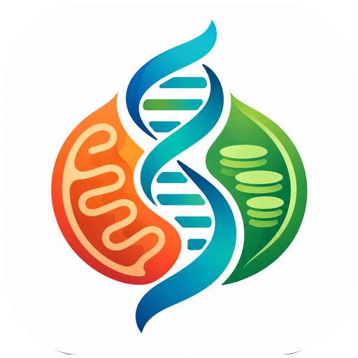

<div align="center">



# OrganelleVerse

**The analysis foundation for AI-driven plant organelle genomics.**

[English](README.md) | [简体中文](README.zh-CN.md)

</div>

## What it is

OrganelleVerse is the base layer that lets an AI assistant — or you — analyse plant mitochondrial and
chloroplast genomes, from raw reads to an annotated, checked, compared genome.

Every analysis is one clearly named function with declared inputs and outputs. It runs the real
programs, tells you plainly when something cannot run, and records exactly what it did. That is what
makes it safe to hand to an AI: the AI calls a function, and you can read, trust and repeat the result.

- **Get data**: reads and genomes from public databases.
- **Assemble** the mitochondrial or chloroplast genome, and **annotate** it (genes, tRNAs, rRNAs).
- **Check** the result with a quality report.
- **Look into** a genome: repeats, codon use, RNA editing, trans-splicing, IR boundaries.
- **Compare** genomes: gene content, gene order, pangenome, barcodes.
- **Study evolution**: trees, dating, selection, co-evolution, populations, gene transfer.
- **Draw** maps, trees and heatmaps, and **measure** organelles in microscope images.

Results are ordinary files: FASTA, GenBank, GFF3, tables, figures and a readable report.

## The 23 analysis modules

Each module is one area of `ov` (for example `ov.annotation`). **In-house** means the method is written
and tested in this project. **Existing tools** means it manages programs other people wrote (run
directories, versions, clear failures) and adds its own checks on top.

| Module | What it does | Built how |
|---|---|---|
| `assembly` | Assembles mitochondrial and chloroplast genomes. Runs Oatk, HiMT, GetOrganelle and PMAT2, and **OVASM**, our own assembler: one Rust executable that scans the raw reads once, then returns an assembly graph with the read support for every junction (not just one sequence), and says when the reads cannot tell structures apart. OVASM has its own repository, [forageseed/ovasm](https://github.com/forageseed/ovasm): build it, then put it on your `PATH` or set `ORG_VERSE_OVASM_BIN`. Still being tested across species. | In-house (OVASM) + existing tools |
| `annotation` | Finds protein genes, tRNAs and rRNAs in mitochondrial and chloroplast genomes. It reports what is missing and which candidates it rejected instead of guessing. Searches use LOSAT (or BLAST+); reference profiles ship with the package. | In-house |
| `barcode` | Designs DNA barcodes and primers from an alignment, and identifies a species from a sequence. | In-house (primers via Primer3) |
| `codon_composition` | Codon usage, RSCU, effective number of codons, GC3 and amino-acid usage. | In-house |
| `coevolution` | Evolutionary rate covariation (ERC): finds genes that evolve together, for example organelle and nuclear partners. | In-house |
| `comparative` | Gene content, gene order (synteny), genome identity along a genome, structural variants, chloroplast orientation. | In-house |
| `composition` | GC content and GC skew along a genome. | In-house |
| `diversity` | Nucleotide diversity, Watterson's theta and Tajima's D, also in sliding windows. | In-house (scikit-allel estimators) |
| `hgt` | Horizontal gene transfer between a donor and a recipient genome. | In-house |
| `ir_boundary` | Chloroplast inverted-repeat junctions (LSC / IRb / SSC / IRa) and the genes at each border, with a drawing. | In-house |
| `localization` | Predicts where a protein goes in the cell. | Existing tools (DeepLoc, TargetP) |
| `morphology` | Finds and measures chloroplasts, mitochondria, vacuoles and nuclei in microscope images; trains models and corrects labels. | In-house (measuring) + existing tools (segmentation) |
| `pangenome` | Builds a graph pangenome, gene presence/absence, core and variable parts, subgraphs, format conversion. | Existing tools (minigraph, PGGB, PanTools) + in-house analysis |
| `phenotype` | Screens for cytoplasmic male sterility (CMS) candidate genes and weighs the evidence for each. | In-house |
| `phylogeny` | Alignment, trimming, maximum-likelihood and Bayesian trees, divergence dating, haplotype networks, ancestral states, tree comparison. | Existing tools (MAFFT, IQ-TREE, MrBayes, RAxML, LSD2, MCMCTree) + in-house networks |
| `population` | Differentiation between populations (F<sub>ST</sub>), variant calling, organelle-nuclear association, nuclear copies of organelle DNA. | In-house + existing tools (DeepVariant, GEMMA) |
| `rna_editing` | Predicts C-to-U editing sites, and detects and checks them in RNA-seq alignments. | In-house + existing models (DeepRed-Mt, PlantC2U) |
| `selection` | Ka/Ks, codon-aware alignment, and selection models: site, branch, branch-site and clade tests. | In-house (Ka/Ks) + existing tools (PAML, HyPhy, KaKs_Calculator) |
| `structure` | Simple repeats, repeat pairs that can recombine (multiple conformations), introns, and structures resolved from an assembly graph. | In-house |
| `trans_splicing` | Finds trans-spliced genes from an annotation. | In-house |
| `transfer` | DNA transferred between organelles, and from organelles into the nucleus, judged by alignment, read depth and long-read support. | In-house |
| `variation` | SNPs against a reference in an alignment, and SNP density. | In-house |
| `visualization` | Genome maps, structure maps, trees, heatmaps, synteny and collinearity, ERC and transfer figures, quality dashboards. | In-house (a few drawings can also use existing drawing programs) |

Also in `ov`, not counted as analyses: `fetch` (download data), `qc` (quality checks), `report` (HTML
report), `format_conversion`, `read` and `write`.

## Install

You need Python 3.11 or newer.

```bash
git clone https://github.com/forageseed/organelleverse.git
cd organelleverse
pip install .
```

Sequence searches (annotation, transfers) use [LOSAT](https://github.com/satoshikawato/LOSAT), a fast
Rust re-implementation of BLAST, whenever it is found; NCBI BLAST+ is the fallback. To use LOSAT, build it
(`cargo build --release`) and either put `losat` on your `PATH` or point `ORG_VERSE_LOSAT_BIN` at the file.

Assembly and some analyses call other existing programs (Oatk, HiMT, GetOrganelle, PMAT2, IQ-TREE, PAML
and others; [OVASM](https://github.com/forageseed/ovasm) is built from its own repository). OrganelleVerse uses the ones already on your computer. To see what it found:

```bash
organelleverse-environments list
```

## Find out how to use a function

Everything hangs off `ov`, grouped by area. Python tells you the rest:

```python
import organelleverse as ov

dir(ov)                              # the areas: assembly, annotation, qc, phylogeny, ...
dir(ov.phylogeny)                    # the functions in one area
help(ov.phylogeny.build_tree)        # what a function does and what each argument means
```

More detail for each area is in `docs/`.

## Quick start

The repository ships one real genome in `examples/data/`: the *Arabidopsis thaliana* mitochondrion
(NCBI RefSeq NC_037304.1) as FASTA and as an annotated GenBank file. The examples use it; other file
names are placeholders for your own data. Examples continue from the ones before them. Each call
returns a result object, and `ov.write(result, "folder")` saves it as files.

### Basics: data, reading, writing, checking

```python
import organelleverse as ov

ov.fetch.entrez_query(organelle="mitochondrion", dest="data/", taxon="Oryza sativa")  # search NCBI
ov.fetch.fetch_accessions(accessions=["NC_037304"], dest="data/")                     # or pick by accession

fasta = "examples/data/arabidopsis_mitochondrion.fasta"
genome = ov.read(fasta, organelle="mitochondrion", species="Arabidopsis thaliana")    # sequence only
annotated = ov.read("examples/data/arabidopsis_mitochondrion.gb",
                    organelle="mitochondrion", species="Arabidopsis thaliana")        # with annotation
```

`ov.read(...)` also reads sequencing reads: `ov.read("sample.hifi.fastq.gz", technology="hifi")`.
`technology` is `"hifi"`, `"ont"`, `"clr"` or `"illumina"` (for paired Illumina reads pass both files:
`["r1.fastq.gz", "r2.fastq.gz"]`). Not sure? Use `technology="auto"`: it reads the read names to work out
the platform, and tells you if it cannot instead of guessing.

```python
ov.qc.read_statistics("sample.hifi.fastq.gz")     # read lengths and quality
ov.format_conversion.convert(annotated)           # GenBank to GFF3 and FASTA
```

### `ov.assembly`: assemble a genome from reads

```python
data = ov.read("sample.hifi.fastq.gz", technology="hifi")
assembly = ov.assembly.assemble(data, organelle="mitochondrion")   # the assembler is chosen for you
ov.write(assembly, "results/assembly")

ov.assembly.check_all_backends()                  # which assemblers are installed
ov.qc.assembly(assembly)                          # quality check of the assembly
```

`organelle` is `"mitochondrion"` or `"plastid"`.

OVASM takes HiFi, raw ONT, raw CLR and Illumina reads (single or paired-end), and **long + Illumina hybrid**
(ONT or CLR together with one Illumina library: the accurate short reads correct the noisy long reads).
For a hybrid, pass both libraries to `ov.read(long_libraries=..., short_libraries=...)`. HiFi is the
best-tested route; Illumina-only and hybrid are still experimental. OVASM does not use the read pairing
itself, and short reads alone can leave the genome in pieces, so check `k_accepted` and `circular` in the
assembly summary.

### `ov.annotation`: genes, tRNAs and rRNAs

```python
annotation = ov.annotation.annotate(genome)       # about a minute: 38 protein genes, 28 tRNAs, 3 rRNAs
ov.write(annotation, "results/annotation")        # GenBank, GFF3, tables, cds.fasta, proteins.fasta

ov.annotation.find_orfs(fasta)                    # open reading frames
ov.annotation.extract(annotated)                  # gene, CDS and protein sequences

report = ov.qc.annotation(annotation)             # quality check of the annotation
ov.write(report, "results/annotation_qc")         # Markdown summary, CSV tables, JSON
ov.report.build(annotated, [report])              # one HTML report
```

Open the Markdown file in the output folder for a plain summary; the CSV tables hold the details.

### `ov.barcode`: DNA barcodes

```python
ov.barcode.design("alignment.fasta")                       # barcode regions that tell species apart
ov.barcode.identify("query.fasta", "references.fasta")     # which species is this sequence?
```

### `ov.codon_composition`: codon use

```python
ov.codon_composition.codon_usage("results/annotation/cds.fasta", organelle="mito")
ov.codon_composition.amino_acid("results/annotation/cds.fasta", organelle="mito")
```

### `ov.coevolution`: genes that evolve together

```python
ov.coevolution.run_erc(gene_trees, species_tree)  # evolutionary rate covariation
```

### `ov.comparative`: compare genomes

```python
plastomes = {"Arabidopsis thaliana": "a.gb", "Citrus sinensis": "b.gb", "Amborella trichopoda": "c.gb"}
genomes = [ov.read(path, organelle="plastid", species=name) for name, path in plastomes.items()]

ov.comparative.compare_genes(genomes)             # which genes each genome has
ov.comparative.synteny(genomes)                   # gene order blocks
ov.comparative.detect_structural_variants("reference.fasta", "query.fasta")
```

### `ov.composition`: GC content

```python
ov.composition.gc_content(fasta)                  # GC content and GC skew along the genome
```

### `ov.diversity`: genetic diversity

```python
ov.diversity.nucleotide_diversity("alignment.fasta")
ov.diversity.neutral_tests("alignment.fasta")     # Tajima's D and friends
```

### `ov.hgt`: horizontal gene transfer

```python
ov.hgt.detect("donor.fasta", "recipient.fasta")
```

### `ov.ir_boundary`: chloroplast inverted repeats

```python
chloroplast = ov.read("chloroplast.gb", organelle="plastid", species="Arabidopsis thaliana")
ov.ir_boundary.ir_boundary([chloroplast])         # LSC / IRb / SSC / IRa junctions
```

### `ov.localization`: where proteins go in the cell

```python
ov.localization.predict("results/annotation/proteins.fasta")
```

### `ov.morphology`: organelles in microscope images

```python
ov.morphology.segment("cells.tif")                # find chloroplasts, mitochondria, vacuoles, nuclei
ov.morphology.measure("labels.tif")               # size and shape of each one
```

### `ov.pangenome`: pangenomes

```python
ov.pangenome.gene_pav(genomes)                    # core and variable genes
fasta_genomes = [ov.read(path, organelle="plastid", species=name) for name, path in
                 {"Arabidopsis thaliana": "a.fasta", "Citrus sinensis": "b.fasta"}.items()]
ov.pangenome.build_graph(fasta_genomes)           # a pangenome graph (needs FASTA genomes)
```

### `ov.phenotype`: male-sterility candidates

```python
ov.phenotype.cms(fasta)                           # cytoplasmic male sterility candidate genes
```

### `ov.phylogeny`: trees and networks

```python
ov.phylogeny.align("genes.fasta")
ov.phylogeny.build_tree("alignment.fasta")        # maximum-likelihood tree
ov.phylogeny.haplotype_network("alignment.fasta")
```

### `ov.population`: populations

```python
ov.population.call_variants("bams/", ref_path="reference.fasta")
ov.population.compute_fst("variants.vcf", {"sample1": "north", "sample2": "south"})
```

### `ov.rna_editing`: C-to-U RNA editing

```python
ov.rna_editing.predict_edits(annotated)           # predicted editing sites
ov.rna_editing.detect_editing_sites("rnaseq.bam", "mito.fasta")   # sites seen in RNA-seq reads
```

### `ov.selection`: natural selection

```python
ov.selection.kaks("cds_pairs.fasta")              # Ka/Ks
ov.selection.site_model(alignment="codon.fasta", tree="tree.nwk")
```

### `ov.structure`: repeats and structure

```python
ov.structure.repeats(fasta)                       # simple repeats
ov.structure.multiconf(fasta)                     # repeat pairs that can recombine
```

### `ov.trans_splicing`: trans-spliced genes

```python
ov.trans_splicing.detect_trans_splicing(annotated)
```

### `ov.transfer`: DNA transfer between genomes

```python
ov.transfer.mtpt("mito.fasta", "chloroplast.fasta")     # plastid DNA inside the mitochondrion
ov.transfer.detect(nuclear_fasta="nuclear.fasta", organelle_fasta="mito.fasta")
```

### `ov.variation`: SNPs

```python
ov.variation.snp("alignment.fasta")
ov.variation.snp_density("alignment.fasta")
```

### `ov.visualization`: figures

```python
plot = ov.visualization.genome_map(["examples/data/arabidopsis_mitochondrion.gb"])
ov.write(plot, "results/genome_map.png")
ov.visualization.plot_tree("tree.nwk")
ov.visualization.heatmap({"gene1": {"gene2": 0.8}, "gene2": {"gene1": 0.8}})
```

## Good to know

- **Nothing is hidden.** If a step cannot run (a program is missing, the data is too thin), you get a
  clear message instead of a quietly different result.
- **Results are traceable.** Each output folder records the inputs, programs and versions behind it.
- **Files appear only when you write them.** Work happens in a scratch area; `ov.write(...)` puts the
  final result where you ask.

## Help and contributing

Questions, bugs and ideas are welcome as GitHub issues.

## Citing

There is no paper yet. Please cite this repository, the version (1.0.0), and the programs you ran
(LOSAT, Oatk, HiMT, GetOrganelle, PMAT2, BLAST+, HMMER, NCBI resources).

## License

MIT
